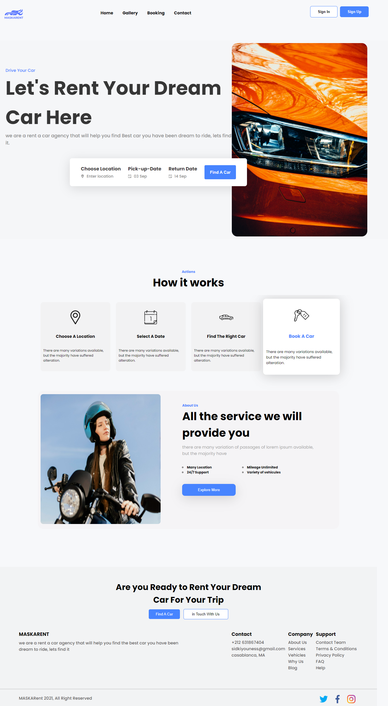
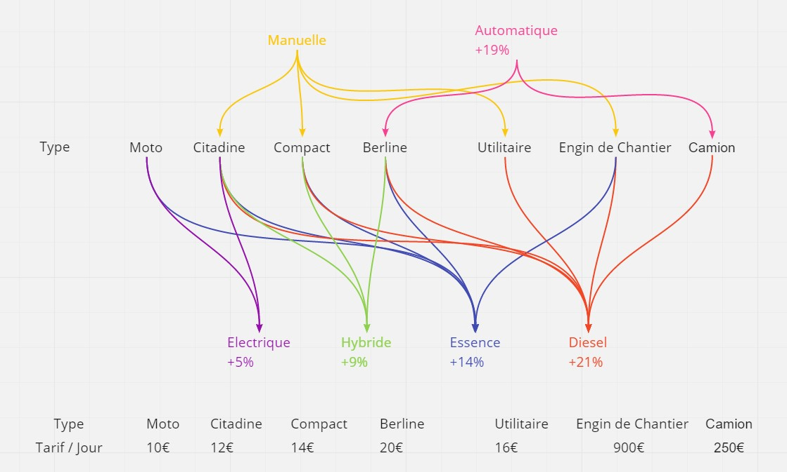

# MASKARENT Renting Agency | rental luxury Vehicles :

MASKARENT project is brief from simplon (Youcode Campus)

## Project context :

The website should contain following pages:

<ul>
<li>Home (well representative for the website)</li>
<li>Gallery (groups together all the agency's products)</li>
<li>
Reservation (contains an estimate form for the amount to be paid according to the criteria mentioned below)</li>
<li>Contact (contains a form which takes [name, email, subject, message] and displays a message with the details entered)</li>
</ul>

## Booking form criteria:

<ul>
<li>vehicle type: motorcycle, compact, city dweller, utility, sedan / berlin, truck, construction machine
</li>
<li>fuel: gasoline, diesel, electric, hybrid</li>
<li>gearbox: manual, automatic</li>
<li>reservation duration (in days)</li>
<li>calculate the price estimate according to the criteria entered</li>
</ul>

 

 

## conditions :

<ul>
<li>Use Flex</li>
<li>Design will be responsive</li>
<li>Website will respect SEO condition</li>

</ul>

## Learning methods :

**Working methods : `individual`**
 
**Temporality:`6 Days`**

## preview my work :

**<a style="text-decoration:underline;" href="https://maskadev.github.io/responsive_renting_app/">Github Pages</a>**
 